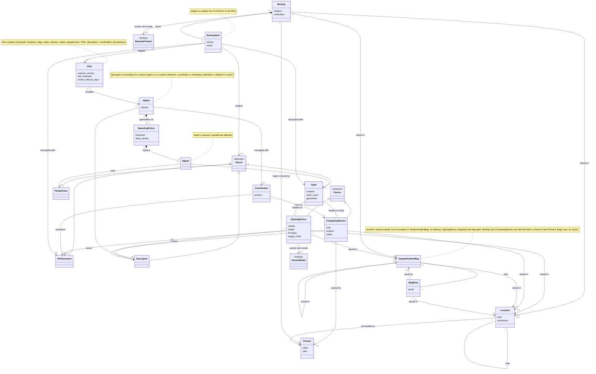

# Bitcoin Custody Plan Ontology

Vocabulary for describing a multisig custody plan as input to the threat analysis. It stores only **facts about the plan**; anything that can be derived from them is not stored.

Draft v0.9. The formal definition is [SetupOntology.schema.json](SetupOntology.schema.json) (JSON Schema); it is normative, this document explains it.

## Design rules

- The main purpose is multisig; a single-sig wallet for a seed (e.g. a tripwire) is modelled the same way. Mainnet only.
- The schema supports more than is used (other seed schemes and word counts, shares, several passphrases). The user is never asked for or pointed to those; defaults apply (BIP39, 12 words, no passphrase, no delay).
- Good defaults wherever possible; the user only states deviations.
- Device models and backup products are not described in the plan; they are looked up in catalogs (see "Lookup tables").
- Links are stored once but are navigable in both directions.
- People, not roles, are the actors. Names are pseudonyms.

Common to **all** entities: `id` (stable slug, e.g. `seed-main2`), `name`, `comment` (free text).

## Overview

The classes, their parents and the names of their collections are defined in the `x-classes` table of `SetupOntology.schema.json`, and the properties that point to other entities carry an `x-ref` mark with the class they must point to. The tests check this diagram against that table.

## Entities

### Plan (root)

The whole setup and the planning document describing it are one entity: it contains the wallets and, like any secret or device, has backups (a Backup item can reference the Plan).

| Attribute | Notes |
|---|---|
| `schema_version` | |
| `last_reviewed`, `review_interval_days` | |
| collections | `people`, `locations`, `bags`, `strips`, `devices`, `computing_devices`, `seeds`, `passphrases`, `pins`, `descriptors`, `wallets`, `coordinators`, `backups`, `practices` |
| `travel_times` | list of `{from, to, minutes}` between two **Location** ids, in both directions; a sub-location counts as its top-level place; cloud and person places need no travel |

### Secret (abstract)

Superclass of everything that must stay confidential and can be backed up: **Seed**, **Passphrase**, **PinPassword**, **Descriptor**. A Descriptor is only partly secret (privacy, not funds), but is handled the same way. Backups can hold any Secret (and the Plan).

### Seed

The secret root. Individual keys are not modelled: seed plus descriptor determine them.

| Attribute | Notes |
|---|---|
| `scheme` | `bip39` (default), `slip39`, `codex32`, `seedxor`, `electrum`, `aezeed` |
| `word_count` | `12` (default), `15`, `18`, `21`, `24` |
| `generation` | `device_rng`, `dice`, `cards` |
| `devices` | list of **SigningDevice** or **ComputingDevice** ids the seed is loaded on (empty = backup only); a seed on a computing device is a hot seed |

The seed-device link carries no further attributes. How a given device stores a seed (internal, PIN-encrypted, SD card, smartcard, ...) is a property of the device model in the catalog.

### Passphrase

A BIP39 passphrase. It is not linked to a seed directly; a seed and a passphrase are related only through a **Signer** that contains both. The same seed with different passphrases yields different hidden wallets, so one seed can appear in several signers with different passphrases. Written copies are Backup items.

### PinPassword

A PIN or a password; deliberately not distinguished. Referenced by `SigningDevice.pin`, `Coordinator.password` and by `encrypted_with` of a Backup item. Written copies are Backup items.

### Descriptor

Public wallet configuration: the set of all xpubs plus the script and derivation. Format and encryption are stated per Backup item, not here. A copy is a Backup item, or a registration on a SigningDevice (`stores_descriptors`), from which it can usually be exported again. A wallet has at most one descriptor. It is mandatory for a wallet with several signers or a custom definition, and every descriptor must have at least one copy somewhere.

| Attribute | Notes |
|---|---|
| `wallet` | ref **Wallet** |

### SigningDevice

Dedicated key store that holds seeds and descriptor registrations and signs. It never hosts a coordinator: that is what a **ComputingDevice** is for.

| Attribute | Notes |
|---|---|
| `vendor`, `model` | both, because attacks target a vendor or only one model |
| `use` | `regular` if the device is used so often (at least yearly) that it is powered on and a defect noticed anyway; measures that follow from this count as in place without a practice |
| `firmware` | `{version, source: preinstalled \| vendor_download \| self_built}` |
| `supply_chain` | list of hops the device passed: `vendor`, `reseller`, `mail` |
| `pin` | ref **PinPassword** |
| `stores_descriptors` | list of **Descriptor** ids registered on the device; a registration is a digital copy that can be exported again |
| `stored_in` | ref **Location** or **TamperEvidentBag** |

Vendor and model reference the device catalog (see "Lookup tables"); capabilities such as secure element, anti-phishing words, PSBT transport or power supply come from there, not from the plan.

### ComputingDevice

A phone, laptop or desktop computer. It can hold coordinator software, seeds (a hot wallet), descriptors and any other digital file. A hot wallet is a computing device that holds a seed and runs the coordinator of the wallet.

| Attribute | Notes |
|---|---|
| `name` | label |
| `kind` | `mobile` (always carried: `stored_in` a person), `laptop` (a person or a location), `desktop` (a location, never a person) |
| `product` | operating system or model, informational |
| `use` | `regular`: used so often (at least yearly) that a defect is noticed anyway |
| `stores_descriptors` | list of **Descriptor** ids kept on the device as a digital copy |
| `stored_in` | `{location}`, `{bag}` or `{person}` |

"Device" in the analysis means a SigningDevice or a ComputingDevice, for example in the device check and in the threats against a lost, broken or compromised device.

### TamperEvidentBag

Holds several items (devices, backups, other bags, strips) and sits at a location or inside another bag.

| Attribute | Notes |
|---|---|
| `strip` | ref **BagStrip**, the top strip that belongs to this bag |
| `stored_in` | ref **Location** or **TamperEvidentBag** (no cycles) |

Contents are all devices, backups, bags and strips whose `stored_in` points to this bag.

### BagStrip

The detachable top strip of a bag. Its serial number is compared with the one on the bag to detect a swapped or reopened bag.

| Attribute | Notes |
|---|---|
| `serial` | the number |
| `stored_in` | ref **Location** or **TamperEvidentBag** |

Not a Secret: its serial number is not confidential.

### Wallet

| Attribute | Notes |
|---|---|
| `spending_policies` | list of **SpendingPolicy** (at least one) |
| `descriptor` | ref **Descriptor**; mandatory for several signers or a custom definition |
| `definition` | `default` (the default) or `custom`, see below |
| `coordinator` | ref **Coordinator** (mandatory) |
| `tripwire` | `{enabled: bool, amount_sat}` |

**SpendingPolicy** (nested in Wallet): one way to spend the wallet.

| Attribute | Notes |
|---|---|
| `signers` | list of **Signer** (at least one) |
| `threshold` | number of signers required |
| `delay_blocks` | relative timelock before the policy becomes usable; `0` = immediately (max 65535 blocks, about 455 days). Absolute timelocks are not modelled: coordinators support them poorly |

**Signer** (nested in SpendingPolicy): `{seed, passphrase}`. `seed` is required, `passphrase` is optional (at most one).

**`definition: default`** is native SegWit with the standard derivation: for a single-sig wallet BIP84 (P2WPKH); for a multisig wallet P2WSH with sorted keys and BIP48 script type 2'. Such a descriptor is fully determined by the keys of all signers of all policies. **`custom`** is every other descriptor (other script, other derivation, other policy structure); it is not determined by the keys, so it exists only as an explicit copy.

Examples: `2 of [A,B,C], delay 0` is the normal multisig; `1 of [A,B,C,D], delay 52000` is a recovery branch. A single-sig wallet (e.g. a tripwire) is one policy `1 of [A], delay 0`. A seed may appear in several wallets.

### Coordinator

Software that builds and watches wallets (threat category "SW Wallet / Coordinator").

| Attribute | Notes |
|---|---|
| `product` | e.g. Sparrow, Nunchuk |
| `runs_on` | ref **ComputingDevice** the software runs on (mandatory); a SigningDevice cannot host a coordinator. Together with a seed on that device it is a hot wallet |
| `password` | optional ref **PinPassword** protecting the application or its wallet file |

### Backup

A **carrier**: one physical object or file at one place. It can hold several items (e.g. a USB stick with descriptor and plan). Each further copy is its own Backup. Works the same for seeds, passphrases, PINs/passwords, descriptors and the plan.

| Attribute | Notes |
|---|---|
| `medium` | `paper`, `metal`, `usb_drive`, `sd_card`, `cloud_storage`, `memory` (in a person's head) |
| `product` | optional `{vendor, model}` reference into the backup-product catalog, mainly for `metal` |
| `stored_in` | `{location}`, `{bag}` or `{person}`; `memory` requires `{person}` and only `memory` may use it |
| `items` | list of `{subject, format, encrypted_with, share}` |
| `verification` | `{last_verified, interval_days}` |

Item fields:

- `subject`: ref to a Secret or the Plan.
- `format`: seeds `words` (default), `seedqr`, `binary`, `hex`; descriptors `text`, `qr`, `file`; plan `pdf`, `printed`; PIN/password/passphrase `text`. The product catalog constrains which formats a product can hold.
- `encrypted_with`: list of **Seed** or **PinPassword** refs (or none); any one of them decrypts the item. A Seed is kept as its own case because it is handled very differently from a PIN or password.
- `share`: optional `{index, threshold, total}` for Shamir-style splits; supported by the schema, never requested from the user.

### Location

A place where devices, bags and backups are kept. Locations can be nested (a safe inside the home); access to a sub-location also requires access to its parent.

| Attribute | Notes |
|---|---|
| `kind` | see [LocationKinds.csv](Lookups/LocationKinds.csv) |
| `part_of` | ref parent **Location** |
| `jurisdiction` | country / legal area |
| `provider` | bank or cloud provider if a third party operates the place; absent means private |
| `near` | list of **Location** ids close enough to be hit by the same area-wide event (flood, earthquake, war); binary, symmetric, not transitive; a location is always near its parent and sub-locations |
| `access` | list of **Person** ids who can physically reach it |

Concealment, physical security and intrusion alerting are deliberately not attributes of a location; they follow from its `kind` and live in the lookup table.

### Person

An actor of the plan. `Location.access` expresses physical reach only. The information needed to use what is stored somewhere (decryption secrets, PINs) is expressed by the `encrypted_with` and `pin` links; there is no separate access object.

| Attribute | Notes |
|---|---|
| `name` | pseudonym |
| `roles` | list of `owner`, `heir`, `trustee` (a third party holding something or helping, e.g. relative, lawyer) |
| `may_spend` | when the person should be able to spend, alone or with others; see below |

**A person as a place.** `stored_in: {person: id}` puts an item into the person: a memory backup is in the head, a mobile phone is carried. The model makes a place `person:<id>` that only that person reaches. Death, incapacity or amnesia of the person destroy the memory backups in it; a phone or laptop they carry survives and stays where it is, reachable by whoever finds it. A person is never declared as a Location.

Roles are labels that grant nothing. Only `owner` has a meaning for the analysis: it decides the severity when someone loses access to the main funds. Signing is an action, not a role.

**Access rights (`may_spend`).** Each entry says that the person may spend, and is a promise of the plan, not a mechanism:

| Field | Notes |
|---|---|
| `with` | other people who must act together with the person; default: alone |
| `after_blocks` | not before this many blocks (144 blocks are about a day), the unit of the spending policy delays; default: at once |
| `wallets` | default: every main wallet |

An entry names the whole set of people, so it is stated once, on any one of them. Nothing links a right to a spending policy. The analysis finds out whether the people of a right can obtain what a policy needs (signers, passphrases, descriptor) and gives a warning if they cannot, or if they can spend earlier than the right says, or if people without a right can spend. A person who is dead or incapacitated is no longer expected to act: rights that involve them are void. Every main wallet needs at least one right.

### Practice

A measure the owners commit to as part of the setup: a procedural mechanism from the [mechanism catalogue](GenericThreatModelling/Mechanisms.json) such as a regular check, a setup-time precaution or a periodic renewal. Only measures listed here count for the analysis; structural mechanisms (e.g. several signers required, a PIN on the device) follow from the plan itself and are not listed. The setup is static: a practice states what is done, not when it was last done.

| Attribute | Notes |
|---|---|
| `mechanism` | id of a procedural mechanism (`M-P-…` or `M-D-…`) |
| `scope` | optional list of entity ids the practice covers; default: every entity of the mechanism's target class |
| `interval_months` | optional override of the catalogue's interval |

## Lookup tables (not part of the input)

The plan only names vendor and model; details live in catalogs. [LocationKinds.csv](Lookups/LocationKinds.csv) is the third lookup.

Files in [Lookups](Lookups/):

- [SigningDeviceCatalog.csv](Lookups/SigningDeviceCatalog.csv): 31 devices.
- [MetalBackupCatalog.csv](Lookups/MetalBackupCatalog.csv): 37 metal products.

The initial data was copied from The Bitcoin Hole on 2026-10-05 (third-party data; every row has `source_url` and `retrieved`). From here on we curate the tables ourselves. A blank cell means unknown or not in the source. Lists use `;` as separator.

### Device catalog (key: vendor, model)

Covers Blockstream Jade (4 variants), Coinkite (Coldcard Mk4, Mk5, Q, Tapsigner), Keystone 3 Pro, Foundation Passport (Core, Prime), BitBox02 and BitBox02 Nova, Trezor (Model One, Model T, Safe 3, Safe 5, Safe 7), SeedSigner, Specter (DIY, Shield, Shield Lite), OneKey (Classic 1S, Classic 1S Pure, Pro), Keycard Shell and Ledger (Flex, Nano Gen5, Nano S Plus, Nano X, Stax). Where a vendor sells a Bitcoin-only and a multi-coin variant, only the Bitcoin-only one is listed and its model name carries no suffix.

| Group | Attributes |
|---|---|
| Origin | `assembled_in`, `vendor_headquarters` (jurisdiction of the vendor), `diy` |
| Security | `air_gapped`, `secure_element` (type), `supply_chain_protection`, `anti_exfil`, `secure_boot` |
| Firmware | `bitcoin_only`, `upgrade_methods` (microsd, usb_storage, usb, bluetooth, nfc), `open_source`, `reproducible_builds` |
| Device lock | `pin`, `dynamic_keypad`, `brick_pin`, `brick_countdown`, `unlock_delay`, `anti_phishing_words`, `alphanumeric_pin`, `duress_wallet` |
| Seed handling | `stateless`, `user_entropy`, `multiple_keys`, `bip39_passphrase`, `bip85`, `slip39`, `seedxor`, `seedqr`, `sd_backup`, `seed_storage` (internal, pin-encrypted, sd-encrypted, smartcard, none), `seed_import_export` |
| Signing | `psbt_transport` (usb, bluetooth, nfc, microsd, qr), `qr_formats`, `multisig`, `descriptor_registration`, `miniscript`, `taproot_miniscript`, `change_verification`, `address_verification` |
| Power | `battery`, `battery_removable`, `battery_size`, `power_input` |
| Physical | `display`, `input` |
| Compatibility | `coordinators` (Sparrow, Liana, Nunchuk, ...) |

The source has no data for `assembled_in`, `diy` and `seed_storage`; these columns are blank until we curate them. `descriptor_registration` is curated by hand: `registers` (the device keeps the wallet configuration and checks it before signing), `per_transaction` (the configuration has to be loaded for every signing, e.g. SeedSigner), `none`, or `unknown`. Where nothing is known the value is `unknown`.

### Metal backup catalog (key: vendor, model)

Metal only for now: every product whose material contains steel, titanium or aluminium. Excluded: Seedplate (material unknown in the source) and all plastic, paper and card products.

| Group | Attributes |
|---|---|
| Origin | `vendor_headquarters` |
| Material | `material`, `weight`, `dimensions` |
| Marking method | `method` (stamped or punched, etched, engraved, tile assembly), `tools_included`, `tools_required` (e.g. center punch) |
| Encoding | `encodings` (letters, binary, qr), `formats` (bip39_12, bip39_24, seedqr, slip39, hex, ascii, descriptor), `max_chars_hex`, `max_chars_ascii` |
| Resistance | `waterproof`, `fireproof`, `crushproof`, `corrosionproof`, `shockproof`, `stress_tests` |
| Protection | `pin_protection`, `encrypted`, `tamper_evident_seal` |
| Capacity | `multiple_keys`, `shamir` (only filled if more than one share) |

The source has no data for `method` and `encodings`; these columns are blank until we curate them.

## Not modelled (parked)

- Serial history of a tamper-evident bag (several dated serials), paper type (normal or tear-resistant).
- Script type, address type, network, balances, wallet purpose and status.
- Absolute timelocks.
- Exchanges, software wallets, password managers, password books, disk encryption, node.
- Companies; several owners are only expressed by several persons with role `owner`.
- Adversaries; they belong to the threat analysis, not to the plan.

## Mapping of the dummy CSV

| CSV column | Ontology |
|---|---|
| Schlüssel-Name | Seed (+ a single-sig Wallet if used) |
| Hardware-Wallet | SigningDevice (+ `pin`, bag) |
| SeedBackup | Backup (`medium`) with a Seed item (`format`) |
| SchlüsselOrt | Location (`stored_in` of device, bag and backups) |
| Deskriptor vor Ort? | Backup with a Descriptor item at that Location |
| Anleitung/Nachlassplan | Backup with a Plan item at that Location |
| Stolperdraht-Betrag | `Wallet.tripwire` of the single-sig wallet of that seed |
| Kommentar | `comment` |
| Cloud row | Location `cloud` + Backup with a Descriptor item, `encrypted_with` a Seed |
